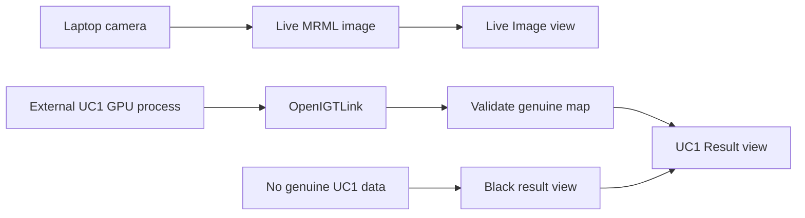

# SLIAFlow Slicer Implementation Roadmap

## Purpose

SLIAFlow is the 3D Slicer visualization component of the STRATUM demonstrator.
It presents a live image beside genuine UC1 output without implementing or
changing the acquisition, UC1, or UC2 algorithms.

This is prototype software. It is not clinically validated and must not be used
with private or identifiable patient data.

## Canonical Windows layout

| Purpose | Location |
| --- | --- |
| Slicer application and base build | `C:\stratum\apps\SR\Slicer-build` |
| Slicer executable | `C:\stratum\apps\SR\Slicer-build\Slicer.exe` |
| SLIAFlow extension source | `C:\stratum\extensions\SLIAFlow` |
| Regenerable extension build | `C:\stratum\build\SLIAFlow` |
| SLIAFlow launcher | `C:\stratum\build\SLIAFlow\SlicerWithSLIAFlow.exe` |
| Complementary project references | `C:\stratum\workspace\components` |
| Meeting and source references | `C:\stratum\workspace\references` |

The base Slicer build stays in place. Only the small extension build may be
regenerated when the SLIAFlow extension source changes.

## First usable milestone

1. Start `SlicerWithSLIAFlow.exe`.
2. Open the `SLIAFlow` module.
3. Show two side-by-side Slicer image views.
4. Show the laptop camera in the left `Live Image` view.
5. Keep the right `UC1 Result` view black and display
   `Waiting for genuine UC1 result` until a real result arrives.

SLIAFlow must never *create* a tumour classification, probability map,
heatmap, or diagnostic result. It only presents data produced outside the
module.

Data that an external producer marks as simulated is displayed only under a
transient, never-persisted operator opt-in and a permanent on-view banner
(`SLIA-010`). A genuine source always takes precedence over a simulated one for
the same map role, and provenance travels with the data, never with the endpoint
it arrived on. Absent or unrecognized provenance is invalid, not a default.

## Implementation order

| Order | Task | Result |
| --- | --- | --- |
| 1 | `SLIA-001` | Canonical repository, clean roadmap, and superseded test prototype |
| 2 | `SLIA-002` | Project context copied safely into `C:\stratum` |
| 3 | `SLIA-003` | Fresh scripted SLIAFlow extension and working launcher |
| 4 | `SLIA-004` | Two black side-by-side image views and basic controls |
| 5 | `SLIA-005` | Live Windows laptop-camera image in the left view |
| 6 | `SLIA-006` | Validated presentation of genuine UC1 result volumes |
| 7 | `SLIA-010` | Simulated result origin, demo mode, and simulated banner |
| 8 | `SLIA-011` | Simulator toolchain and acquisition simulator |
| 9 | `SLIA-012` | Stand-in UC1 maps and map sender |
| 10 | `SLIA-013` | Real UC1 build, runner, and MV class sender |
| 11 | `SLIA-007` | Independently built SlicerOpenIGTLink dependency |
| 12 | `SLIA-008` | LiveView and UC1 OpenIGTLink reception |
| 13 | `SLIA-014` | End-to-end hardware-free workflow verification |
| 14 | `SLIA-016` | Link state that follows the socket, not the connector object |
| 15 | `SLIA-023` | Recorded HSI cubes accepted; acquisition trigger stand-in |
| 16 | `SLIA-022` | Six-panel operator surface with a capture button |
| 17 | `SLIA-024` | UC1 result over a colour image derived from its own cube (MS5 point 2) |
| 18 | `SLIA-021` | UC2 blood-vessel enhancement as an independent producer (MS5 point 3) |
| 19 | `SLIA-009` | Camera-only demonstration and operator runbook |

Orders 14 to 18 are the WP5 demonstrator, planned in
`docs/architecture/WP5_MS5_DEMO_PLAN.md`. That document is the authority on their
scope, the six-view layout and the port reservations; this table is the order.
`SLIA-017` and `SLIA-018` remain open and are worth taking before order 16, since
the demonstrator runs seven ports where the verified session ran two.

SLIA-010 to SLIA-013 stand in for the unavailable hyperspectral camera. The
stand-ins are separate processes outside `extensions/`, so the rule that SLIAFlow
never generates a result is unchanged; SLIAFlow only gains the ability to display
externally produced simulated data under an explicit, non-persisted opt-in and a
permanent on-view banner. SLIA-013 runs the genuine UC1 CUDA pipeline on a
synthetic cube, so only the scene is simulated. Swapping a stand-in for the real
application is a matter of stopping one process and starting another on the same
port.

SLIA-014 verifies that claim rather than restating it. The whole workflow is run
on one machine with no hyperspectral camera - the acquisition stand-in on
`127.0.0.1:18944`, a map producer on `127.0.0.1:18945`, SLIAFlow receiving both -
and the map producer is then swapped for a different one on the same port with no
change to SLIAFlow. The procedure and its recorded evidence are in
`docs/development/end_to_end_verification.md`.

When real hardware arrives, nothing inside `extensions/` changes. The acquisition
application takes over port 18944 and the genuine UC1 pipeline keeps port 18945.
The only change on the producers' side is provenance: a map computed from a real
cube travels as `SLIAFlow.DataOrigin = external-genuine` with no simulation
detail, and SLIAFlow then displays it with no banner and without demo mode.

The first demonstrable checkpoint is reached after SLIA-005. Tasks are completed
one at a time so that each visible behavior can be verified in Slicer before the
next integration layer is added.

## User-visible behavior

The module panel uses the following defaults:

- Live source: `Laptop Camera`
- Camera index: `0`
- Result map: `tmdMap`
- Acquisition endpoint: `127.0.0.1:18944`
- UC1 endpoint: `127.0.0.1:18945`
- Result status: `Waiting for genuine UC1 result`

The live and result images were originally placed in separate views, on the
grounds that the laptop RGB image and HSI-derived maps are not registered.
`docs/architecture/decisions/ADR-0001-overlay-result-on-cube-derived-rgb.md`
supersedes that decision and narrows it: an algorithm result may be composited
over a background **derived from the same hyperspectral cube it was computed
from**, which is registered with it by construction, and may never be composited
over the laptop camera, which is not. SLIAFlow performs no registration or
resampling; its only run-time safeguard is a refusal to composite images of
different dimensions.

## OpenIGTLink contract

The networking tasks use these device names and data shapes:

| Device name | Required image data |
| --- | --- |
| `LiveView` | Three-component RGB `uint8` |
| `UC1_TMD` | One-component `float32` in `[0,1]` |
| `UC1_MV_CLASS` | One-component `uint8` containing class values 1 through 4 |
| `UC1_MV_PROB` | One-component `float32` in `[0,1]` |
| `UC1_SVM_PROB` | Four-component `float32` in `[0,1]` |
| `UC1_KNN_PROB` | Four-component `float32` in `[0,1]` |
| `UC1_RGB` | Three-component `uint8`, composed from the cube's 710/540/480 nm bands (`SLIA-024`) |
| `UC2_BV` | Three-component `uint8`, the PNG UC2 writes, as written (`SLIA-021`) |
| `HSCube` | The captured cube, `uint16` (`SLIA-023`) |
| `Control` | `STRING`, bidirectional: capture trigger and readiness (`SLIA-023`) |

Ports, one per channel:

| Port | Channel | State |
| ---: | --- | --- |
| 18944 | `LiveView` | In use |
| 18945 | `UC1_MV_CLASS` and `UC1_RGB` | In use; `UC1_RGB` added by `SLIA-024` |
| 18946 | `UC2_BV` | `SLIA-021` |
| 18947 | `HSCube` | `SLIA-023` |
| 18948 | `Stereoscopic` | **Reserved. No producer. Black panel with its reason.** |
| 18949 | `UC2_STO2` | **Reserved. No algorithm. Black panel with its reason.** |
| 18950 | `Control` | `SLIA-023` producer side, `SLIA-022` Slicer side |

`UC1_RGB` shares port 18945 with `UC1_MV_CLASS` deliberately. One producer
sending a result and its background from one cube over one connection makes
"same capture" a property of the transport rather than an assumption. See
`ADR-0001`.

Class values are normal (1), tumour (2), hypervascularized (3), and background
(4). SVM and KNN maps require a class selector because they contain four
probability components.

Normalization and creation of the maps remain the responsibility of the external
UC1 wrapper. SLIAFlow validates and displays received data; it does not infer
`tmdMap`, change UC1 or UC2, or reinterpret malformed values.

## Safety boundaries

- No changes to AcquisitionSystemApp, UC1, or UC2 are part of this roadmap.
- No private medical data is permitted.
- Missing, disconnected, or invalid result data produces a black result view and
  an explicit status, never fabricated output.
- MRML node IDs are stored for internal references because node names are not
  unique.
- Commit, push, merge, and lifecycle completion require separate project-owner
  approval.
