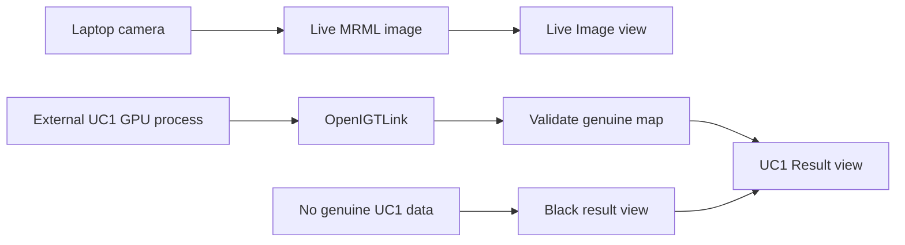

# SLIAFlow Slicer Implementation Roadmap

## Purpose

SLIAFlow is the 3D Slicer visualization component of the STRATUM demonstrator.
It presents a live image beside genuine UC1 output without implementing or
changing the acquisition, UC1, or UC2 algorithms.

This is prototype software. It is not clinically validated and must not be used
with private or identifiable patient data.

## Canonical Windows layout

| Purpose | Location |
| --- | --- |
| Slicer application and base build | `C:\stratum\apps\SR\Slicer-build` |
| Slicer executable | `C:\stratum\apps\SR\Slicer-build\Slicer.exe` |
| SLIAFlow extension source | `C:\stratum\extensions\SLIAFlow` |
| Regenerable extension build | `C:\stratum\build\SLIAFlow` |
| SLIAFlow launcher | `C:\stratum\build\SLIAFlow\SlicerWithSLIAFlow.exe` |
| Complementary project references | `C:\stratum\workspace\components` |
| Meeting and source references | `C:\stratum\workspace\references` |

The base Slicer build stays in place. Only the small extension build may be
regenerated when the SLIAFlow extension source changes.

## First usable milestone

1. Start `SlicerWithSLIAFlow.exe`.
2. Open the `SLIAFlow` module.
3. Show two side-by-side Slicer image views.
4. Show the laptop camera in the left `Live Image` view.
5. Keep the right `UC1 Result` view black and display
   `Waiting for genuine UC1 result` until a real result arrives.

SLIAFlow must never *create* a tumour classification, probability map,
heatmap, or diagnostic result. It only presents data produced outside the
module.

Data that an external producer marks as simulated is displayed only under a
transient, never-persisted operator opt-in and a permanent on-view banner
(`SLIA-010`). A genuine source always takes precedence over a simulated one for
the same map role, and provenance travels with the data, never with the endpoint
it arrived on. Absent or unrecognized provenance is invalid, not a default.

## Implementation order

| Order | Task | Result |
| --- | --- | --- |
| 1 | `SLIA-001` | Canonical repository, clean roadmap, and superseded test prototype |
| 2 | `SLIA-002` | Project context copied safely into `C:\stratum` |
| 3 | `SLIA-003` | Fresh scripted SLIAFlow extension and working launcher |
| 4 | `SLIA-004` | Two black side-by-side image views and basic controls |
| 5 | `SLIA-005` | Live Windows laptop-camera image in the left view |
| 6 | `SLIA-006` | Validated presentation of genuine UC1 result volumes |
| 7 | `SLIA-010` | Simulated result origin, demo mode, and simulated banner |
| 8 | `SLIA-011` | Simulator toolchain and acquisition simulator |
| 9 | `SLIA-012` | Stand-in UC1 maps and map sender |
| 10 | `SLIA-013` | Real UC1 build, runner, and MV class sender |
| 11 | `SLIA-007` | Independently built SlicerOpenIGTLink dependency |
| 12 | `SLIA-008` | LiveView and UC1 OpenIGTLink reception |
| 13 | `SLIA-014` | End-to-end hardware-free workflow verification |
| 14 | `SLIA-016` | Link state that follows the socket, not the connector object |
| 15 | `SLIA-023` | Recorded HSI cubes accepted; acquisition trigger stand-in |
| 16 | `SLIA-022` | Six-panel operator surface with a capture button |
| 17 | `SLIA-024` | UC1 result over a colour image derived from its own cube (MS5 point 2) |
| 18 | `SLIA-021` | UC2 blood-vessel enhancement as an independent producer (MS5 point 3) |
| 19 | `SLIA-009` | Camera-only demonstration and operator runbook |

Orders 14 to 18 are the WP5 demonstrator, planned in
`docs/architecture/WP5_MS5_DEMO_PLAN.md`. That document is the authority on their
scope, the six-view layout and the port reservations; this table is the order.
`SLIA-017` and `SLIA-018` remain open and are worth taking before order 16, since
the demonstrator runs seven ports where the verified session ran two.

SLIA-010 to SLIA-013 stand in for the unavailable hyperspectral camera. The
stand-ins are separate processes outside `extensions/`, so the rule that SLIAFlow
never generates a result is unchanged; SLIAFlow only gains the ability to display
externally produced simulated data under an explicit, non-persisted opt-in and a
permanent on-view banner. SLIA-013 runs the genuine UC1 CUDA pipeline, and
since SLIA-023 on recorded cases, so only the acquisition is simulated. Swapping a stand-in for the real
application is a matter of stopping one process and starting another on the same
port.

SLIA-014 verifies that claim rather than restating it. The whole workflow is run
on one machine with no hyperspectral camera - the acquisition stand-in on
`127.0.0.1:18944`, a map producer on `127.0.0.1:18945`, SLIAFlow receiving both -
and the map producer is then swapped for a different one on the same port with no
change to SLIAFlow. The procedure and its recorded evidence are in
`docs/development/end_to_end_verification.md`.

When real hardware arrives, nothing inside `extensions/` changes. The acquisition
application takes over port 18944 and the genuine UC1 pipeline keeps port 18945.
The only change on the producers' side is provenance: a map computed from a real
cube travels as `SLIAFlow.DataOrigin = external-genuine` with no simulation
detail, and SLIAFlow then displays it with no banner and without demo mode.

The first demonstrable checkpoint is reached after SLIA-005. Tasks are completed
one at a time so that each visible behavior can be verified in Slicer before the
next integration layer is added.

## User-visible behavior

Since `SLIA-022` the module presents the six-view WP5 operator surface, in two
rows of three:

| LiveView | Stereoscopic | HS Cube |
| --- | --- | --- |
| **Relative StO2** | **Enhanced Vascularization** | **Tumour Delineation** |

Since `SLIA-027`
(`docs/architecture/decisions/ADR-0003-integrated-capture-and-uc1-in-slicer.md`)
the panels behave as follows, with no OpenIGTLink link in the module:

- **LiveView** shows the laptop camera, which stands in for the acquisition
  system's LiveView. With no image yet it is black and says what it is waiting
  for.
- **Stereoscopic** and **Relative StO2** are black and carry their reason on
  screen: no producer yet, and ports 18948 and 18949 reserved.
- **HS Cube** is black and says the cube is not displayed: UC1 reads the
  recorded case from disk.
- **Enhanced Vascularization** is black and says no UC2 producer exists yet
  (`SLIA-021`).
- **Tumour Delineation** shows one of the five UC1 output images, chosen under
  **Delineation output**, on its own. Before the first result it is black and
  says it is waiting for a capture.
- **Capture** freezes LiveView, saves the frame under `workspace/captures`, picks
  a recorded case from a shuffled pool, runs
  `stratum.opt.intermediate.exe` in the background with a 60 s timeout, and
  resumes LiveView when the run ends. It is enabled only while the camera runs
  and no capture is in progress.
- Camera index and camera-support install are in a collapsed Developer section,
  with the current result's file, case and capture ID.

Defaults: camera index `0`, delineation output `imageRGB.bmp`.

The earlier design below - links, a live-source selector, demo mode, layers,
and a UC1 map composited over `UC1_RGB` - is superseded by ADR-0003 and kept as
the record of why it was built.

The live and result images were originally placed in separate views, on the
grounds that the laptop RGB image and HSI-derived maps are not registered.
`docs/architecture/decisions/ADR-0001-overlay-result-on-cube-derived-rgb.md`
supersedes that decision and narrows it: an algorithm result may be composited
over a background **derived from the same hyperspectral cube it was computed
from**, which is registered with it by construction, and may never be composited
over the laptop camera, which is not. SLIAFlow performs no registration or
resampling; its only geometric safeguard is a refusal to composite images of
different dimensions. Under rule 3 of that ADR a result is composited only over a
background from its own producer on its own connection, so `UC2_BV` has its own
panel and is never drawn over `UC1_RGB`.

As implemented by `SLIA-024`, the delineation panel puts `UC1_MV_CLASS` over
`UC1_RGB` only when the background carries the map's capture ID and has exactly
the map's dimensions, origin and simulation detail. The capture ID and the
map-alone presentation of a size mismatch are
`docs/architecture/decisions/ADR-0002-uc1-background-capture-identity-and-mismatch.md`,
accepted on 2026-09-16. In every other case - no background yet, another capture,
different size, different provenance, or not a three-component `uint8` image - the map is shown
alone, exactly as before, and the **Background** line under the result source
says why. The background is found by its exact device name only, so the laptop
camera volume and a `LiveView` stream are never candidates, whatever they are
called. The layer opacity moves the map over the image: 0 shows the image alone
and 1 the map alone.

## OpenIGTLink contract

Since `SLIA-027` SLIAFlow creates no connector and the operator workflow uses
none of the device names below (ADR-0003). They are kept for `SLIA-030`.

The networking tasks use these device names and data shapes:

| Device name | Required image data |
| --- | --- |
| `LiveView` | Three-component RGB `uint8` |
| `UC1_TMD` | One-component `float32` in `[0,1]` |
| `UC1_MV_CLASS` | One-component `uint8` containing class values 1 through 4 |
| `UC1_MV_PROB` | One-component `float32` in `[0,1]` |
| `UC1_SVM_PROB` | Four-component `float32` in `[0,1]` |
| `UC1_KNN_PROB` | Four-component `float32` in `[0,1]` |
| `UC1_RGB` | Three-component `uint8`, composed from the cube's 710/540/480 nm bands (`SLIA-024`) |
| `UC2_BV` | Three-component `uint8`, the PNG UC2 writes, as written (`SLIA-021`) |
| `HSCube` | One-component `uint16`, shape `(bands, lines, samples)` in `(k, j, i)` order: the captured cube's raw counts, with `SLIAFlow.WavelengthsNm` and `SLIAFlow.DatasetFolder` in its metadata (`SLIA-023`) |
| `CaptureTrigger` | `STRING` to the acquisition stand-in: `CAPTURE`, declared US-ASCII, IANA 3 (`SLIA-023`). A `vtkMRMLTextNode`'s encoding number travels to the receiver unchanged, and the VTK default, `VTK_ENCODING_US_ASCII`, is 1, which is not an IANA number and is refused |
| `CaptureReply` | `STRING` from the stand-in, one per trigger: `CAPTURING`, `IGNORED` or `REFUSED` (`SLIA-023`) |
| `CaptureStatus` | `STRING` from the stand-in, on change and every 0.5 s: `IDLE`, `CAPTURING` or `READY ... folder=<case folder>` (`SLIA-023`) |

Ports, one per channel:

| Port | Channel | State |
| ---: | --- | --- |
| 18944 | `LiveView` | In use |
| 18945 | `UC1_MV_CLASS` and `UC1_RGB` | In use; `UC1_RGB` added by `SLIA-024` |
| 18946 | `UC2_BV` | `SLIA-021` |
| 18947 | `HSCube` | In use by the recorded-case stand-in (`SLIA-023`) |
| 18948 | `Stereoscopic` | **Reserved. No producer. Black panel with its reason.** |
| 18949 | `UC2_STO2` | **Reserved. No algorithm. Black panel with its reason.** |
| 18950 | `Control`: `CaptureTrigger`, `CaptureReply`, `CaptureStatus` | Producer side in use (`SLIA-023`); Slicer side implemented (`SLIA-022`) |

The control channel carries three device names rather than one. A connector
re-sends an outgoing node when a message of the same name updates it, so the
trigger and the answers travel under different names; and pyigtl keeps only the
latest message per device name, so the one reply to a trigger cannot share a name
with the state repeated every half second. The exact wording, and why the state is
repeated at all, is in `tools/simulators/README.md` as it stood before `SLIA-028`,
in Git history.

`UC1_RGB` shares port 18945 with `UC1_MV_CLASS` deliberately. One producer
sending a result and its background from one cube over one connection makes
"same capture" a property of the transport rather than an assumption. See
`ADR-0001`.

Class values are normal (1), tumour (2), hypervascularized (3), and background
(4). SVM and KNN maps require a class selector because they contain four
probability components.

Normalization and creation of the maps remain the responsibility of the external
UC1 wrapper. SLIAFlow validates and displays received data; it does not infer
`tmdMap`, change UC1 or UC2, or reinterpret malformed values.

## Safety boundaries

- No changes to AcquisitionSystemApp, UC1, or UC2 are part of this roadmap.
- No private medical data is permitted.
- Missing, disconnected, or invalid result data produces a black result view and
  an explicit status, never fabricated output.
- MRML node IDs are stored for internal references because node names are not
  unique.
- Commit, push, merge, and lifecycle completion require separate project-owner
  approval.
