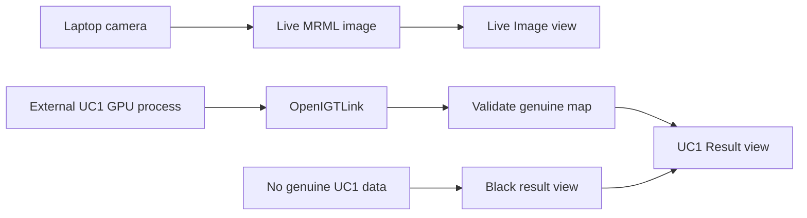

# SLIAFlow Slicer Implementation Roadmap

## Purpose

SLIAFlow is the 3D Slicer visualization component of the STRATUM demonstrator.
It presents a live image beside genuine UC1 output without implementing or
changing the acquisition, UC1, or UC2 algorithms.

This is prototype software. It is not clinically validated and must not be used
with private or identifiable patient data.

## Canonical Windows layout

| Purpose | Location |
| --- | --- |
| Slicer application and base build | `C:\stratum\apps\SR\Slicer-build` |
| Slicer executable | `C:\stratum\apps\SR\Slicer-build\Slicer.exe` |
| SLIAFlow extension source | `C:\stratum\extensions\SLIAFlow` |
| Regenerable extension build | `C:\stratum\build\SLIAFlow` |
| SLIAFlow launcher | `C:\stratum\build\SLIAFlow\SlicerWithSLIAFlow.exe` |
| Complementary project references | `C:\stratum\workspace\components` |
| Meeting and source references | `C:\stratum\workspace\references` |

The base Slicer build stays in place. Only the small extension build may be
regenerated when the SLIAFlow extension source changes.

## First usable milestone

1. Start `SlicerWithSLIAFlow.exe`.
2. Open the `SLIAFlow` module.
3. Show two side-by-side Slicer image views.
4. Show the laptop camera in the left `Live Image` view.
5. Keep the right `UC1 Result` view black and display
   `Waiting for genuine UC1 result` until a real result arrives.

The module must never create or present a simulated tumour classification,
probability map, heatmap, or diagnostic result.

## Implementation order

| Order | Task | Result |
| --- | --- | --- |
| 1 | `SLIA-001` | Canonical repository, clean roadmap, and superseded test prototype |
| 2 | `SLIA-002` | Project context copied safely into `C:\stratum` |
| 3 | `SLIA-003` | Fresh scripted SLIAFlow extension and working launcher |
| 4 | `SLIA-004` | Two black side-by-side image views and basic controls |
| 5 | `SLIA-005` | Live Windows laptop-camera image in the left view |
| 6 | `SLIA-006` | Validated presentation of genuine UC1 result volumes |
| 7 | `SLIA-007` | Independently built SlicerOpenIGTLink dependency |
| 8 | `SLIA-008` | LiveView and UC1 OpenIGTLink reception |
| 9 | `SLIA-009` | Camera-only demonstration and operator runbook |

The first demonstrable checkpoint is reached after SLIA-005. Tasks are completed
one at a time so that each visible behavior can be verified in Slicer before the
next integration layer is added.

## User-visible behavior

The module panel uses the following defaults:

- Live source: `Laptop Camera`
- Camera index: `0`
- Result map: `tmdMap`
- Acquisition endpoint: `127.0.0.1:18944`
- UC1 endpoint: `127.0.0.1:18945`
- Result status: `Waiting for genuine UC1 result`

The live and result images are placed in separate views. They are not overlaid
because the laptop RGB image and HSI-derived maps are not registered.

## OpenIGTLink contract

The networking tasks use these device names and data shapes:

| Device name | Required image data |
| --- | --- |
| `LiveView` | Three-component RGB `uint8` |
| `UC1_TMD` | One-component `float32` in `[0,1]` |
| `UC1_MV_CLASS` | One-component `uint8` containing class values 1 through 4 |
| `UC1_MV_PROB` | One-component `float32` in `[0,1]` |
| `UC1_SVM_PROB` | Four-component `float32` in `[0,1]` |
| `UC1_KNN_PROB` | Four-component `float32` in `[0,1]` |

Class values are normal (1), tumour (2), hypervascularized (3), and background
(4). SVM and KNN maps require a class selector because they contain four
probability components.

Normalization and creation of the maps remain the responsibility of the external
UC1 wrapper. SLIAFlow validates and displays received data; it does not infer
`tmdMap`, change UC1 or UC2, or reinterpret malformed values.

## Safety boundaries

- No changes to AcquisitionSystemApp, UC1, or UC2 are part of this roadmap.
- No private medical data is permitted.
- Missing, disconnected, or invalid result data produces a black result view and
  an explicit status, never fabricated output.
- MRML node IDs are stored for internal references because node names are not
  unique.
- Commit, push, merge, and lifecycle completion require separate project-owner
  approval.
