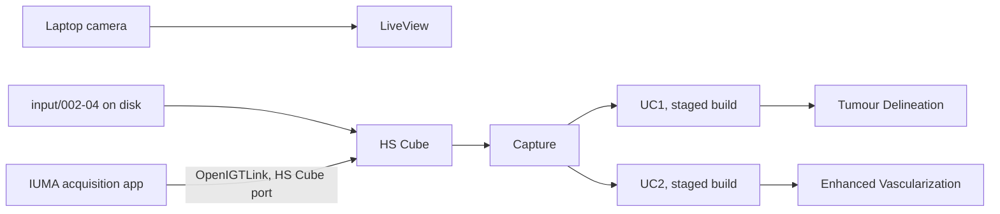

# SLIAFlow Slicer Implementation Roadmap

## Purpose

SLIAFlow is the 3D Slicer visualization component of the STRATUM demonstrator.
It runs the vendored UC1 pipeline and the UC2 blood-vessel enhancement on a
hyperspectral cube, shows the images they write beside the live image and the
cube itself, and connects to IUMA's acquisition app. It does not implement or
change the acquisition, UC1 or UC2 algorithms.

This is prototype software. It is not clinically validated and must not be used
with private or identifiable patient data.

## Where the decisions are

This roadmap says where the project stands and what comes next. It decides
nothing. When it and another document disagree, the order in `AGENTS.md`
applies:

- the accepted ADRs in `docs/architecture/decisions/`, `ADR-0001` to
  `ADR-0005`, which also record what each supersedes;
- the one task in `tasks/active/` or `tasks/review/`;
- the module README, `extensions/SLIAFlow/README.md`, which describes what the
  operator sees in detail.

`WP5_MS5_DEMO_PLAN.md` is the plan the six panels came from. It is kept because
accepted ADRs link to it, and is historical where `ADR-0003` to `ADR-0005`
supersede it: its links, producers and ports are not the current design.

## Canonical Windows layout

| Purpose | Location |
| --- | --- |
| Slicer application and base build | `C:\stratum\apps\SR\Slicer-build` |
| Slicer executable | `C:\stratum\apps\SR\Slicer-build\Slicer.exe` |
| SLIAFlow extension source | `C:\stratum\extensions\SLIAFlow` |
| Regenerable extension build | `C:\stratum\build\SLIAFlow` |
| SLIAFlow launcher | `C:\stratum\build\SLIAFlow\SlicerWithSLIAFlow.exe` |
| Staged UC1 build (`build-uc1.ps1`) | `C:\stratum\build\uc1\UC1` |
| Staged UC2 build (`build-uc2.ps1`) | `C:\stratum\build\uc2` |
| The cube SLIAFlow reads (gitignored) | `C:\stratum\input\002-04` |
| Saved capture frames (gitignored) | `C:\stratum\workspace\captures` |
| Complementary project references | `C:\stratum\workspace\components` |
| Meeting and source references | `C:\stratum\workspace\references` |

The base Slicer build stays in place. Only the small extension build is
regenerated when the SLIAFlow extension source changes.

## What the module does, since SLIA-036

The module presents the six-view WP5 operator surface, in two rows of three:

| LiveView | Stereoscopic | HS Cube |
| --- | --- | --- |
| **Relative StO2** | **Enhanced Vascularization** | **Tumour Delineation** |

- **LiveView** shows the laptop camera, which stands in for the acquisition
  app's LiveView. Showing the app's own stream is `SLIA-037`.
- **Stereoscopic** and **Relative StO2** are black and say what they wait for:
  no producer exists for either.
- **HS Cube** shows the cube Capture uses, band by band, as a colour preview,
  and as a pixel spectrum (`SLIA-032`). **Cube source** chooses IUMA's
  calibrated LCTF cube `002-04` on disk (`ADR-0004`) or the last complete cube
  received from the app (`SLIA-036`).
- **Enhanced Vascularization** shows the map UC2 wrote for the last capture
  (`SLIA-021`).
- **Tumour Delineation** shows one of the five UC1 outputs, chosen under
  **Delineation output** (`imageRGB.bmp` by default), on its own, with nothing
  composited under or over it (`ADR-0003` decision 3, `ADR-0005`).
- **Capture** freezes LiveView, saves the frame, checks the cube, maps it onto
  UC1's 93 model bands (`ADR-0004` decision 4), runs UC1 and UC2 in the
  background, each independently of the other, and resumes LiveView when both
  have ended (`ADR-0003`, `SLIA-027`, `SLIA-033`).
- **Connections** connects to IUMA's acquisition app as an OpenIGTLink client
  on its LiveView, Stereo and HS Cube ports (18944, 18945 and 18946) and shows
  what each one carries. It only receives (`ADR-0004` decision 2, `SLIA-035`,
  `SLIA-036`).

```mermaid
flowchart LR
    Camera[Laptop camera] --> Live[LiveView]
    Disk[input/002-04 on disk] --> Cube[HS Cube]
    App[IUMA acquisition app] -->|OpenIGTLink, HS Cube port| Cube
    Cube --> Capture[Capture]
    Capture --> UC1[UC1, staged build] --> Delineation[Tumour Delineation]
    Capture --> UC2[UC2, staged build] --> Vascular[Enhanced Vascularization]
```

## Rules that hold throughout

- SLIAFlow never creates a classification, probability map, heatmap or
  diagnostic result. It shows what UC1 and UC2 write.
- UC1 and UC2 change only through the versioned patches recorded in
  `docs/development/uc1_changes.md` and `uc2_changes.md`, none of which changes
  the algorithm.
- Results on `002-04` are behavioural, not validated: UC1's model was trained
  on another camera (`ADR-0004` decision 5).
- Every image says where it came from: `SLIAFlow.DataOrigin` is `simulated`
  for a cube read from disk, whose acquisition is simulated, and `received` for
  a cube from the app; a cube from the app's stand-in stays `simulated`.
- No algorithm result is ever composited over the laptop camera (`ADR-0001`).
- A missing, refused or failed result leaves a black panel, or the previous
  result marked as previous, with the reason on screen, never fabricated
  output.

## Build checks

`scripts/development/check-uc1.py` and `check-uc2.py` run the staged builds on
`002-04` and compare with the runs recorded on 2026-10-07, besides independent
oracles (`ADR-0005` decision 3). Nothing compares the patched builds with the
delivered ones any more (`ADR-0005` decision 4). Their checks, and how to record
a run again after a deliberate change, are in `uc1_changes.md` and
`uc2_changes.md`.

## How it got here

Each step is a task card in `tasks/completed/`, which records what was built
and how it was verified.

| Stage | Tasks | Result |
| --- | --- | --- |
| Foundation | `SLIA-001` to `SLIA-005` | Repository, scripted module, two panes, laptop camera |
| External producers | `SLIA-006` to `SLIA-018` | UC1 results received over OpenIGTLink from stand-in producers, verified end to end without a camera (`SLIA-014`) |
| WP5 surface | `SLIA-022` to `SLIA-024` | Six panels, recorded cubes, UC1 over a colour image of its own cube (`ADR-0001`, `ADR-0002`) |
| Integrated capture | `SLIA-025` to `SLIA-028` | Capture and UC1 run inside Slicer; the phantom, producers and session scripts retired (`ADR-0003`) |
| One cube and the app | `SLIA-030` to `SLIA-036`, `SLIA-021` | `002-04` adopted; HS Cube; UC1 and UC2 on the calibrated cube; the app measured, connected, and its cube received (`ADR-0004`) |
| Cleanup | `SLIA-038`, `SLIA-039` | Faster test runs; the old database inputs and the ground-truth overlay retired (`ADR-0005`) |

Two designs of that history no longer hold. The live and result images were
first kept in separate views because they are not registered, which `ADR-0001`
narrowed to compositing only over an image of the same cube. The UC1 result
then arrived from external producers over OpenIGTLink and was composited over
`UC1_RGB`; `ADR-0003` replaced that with Capture inside Slicer and each output
shown on its own. The device names, ports and producers of that design are in
the completed cards and in Git history.

## Next

- `SLIA-037`: the app's LiveView stream in the live pane, instead of the laptop
  camera.
- `SLIA-009`: an operator runbook and shutdown hardening for the built
  application, including the transport helpers the retired producers left.

## Safety boundaries

- No change to AcquisitionSystemApp is part of this roadmap; UC1 and UC2 change
  only as stated above.
- No private medical data is permitted. The data SLIAFlow may read is listed in
  `.ai/policies/medical-data-policy.md`.
- MRML node IDs are stored for internal references because node names are not
  unique.
- Commit, push, merge, and lifecycle completion require separate project-owner
  approval.
