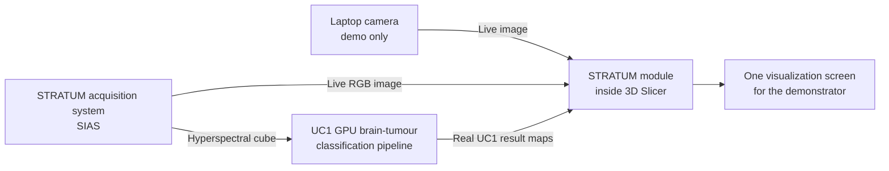

# STRATUM 3D Slicer Module - Plain-Language Overview

> **Status:** workable mock draft for discussion. This document describes only the proposed 3D Slicer visualization module for UC1. It does not define changes to the acquisition application or to the UC1 GPU algorithm.

For the technical companion, see [STRATUM_SLICER_UC1_TECHNICAL_DRAFT.md](STRATUM_SLICER_UC1_TECHNICAL_DRAFT.md).

## 1. The idea in one sentence

Use one 3D Slicer module to show the live camera image and, when the real UC1 GPU process provides them, the brain-tumour classification and probability maps on the same screen.

The Slicer module is the **viewer and coordinator**. It does not perform the UC1 classification itself.

## 2. Overall structure



The laptop camera is only a simple replacement for the unavailable acquisition camera during the first visual demonstration. It fills the live-image area. It does **not** generate or imitate a tumour result.

## 3. What the demonstrator would look like

```text
+----------------------------------+----------------------------------+
| LIVE IMAGE                       | UC1 RESULT                       |
|                                  |                                  |
| Laptop camera, or SIAS LiveView  | Waiting for a genuine UC1 map   |
|                                  |                                  |
+----------------------------------+----------------------------------+
| Camera: Connected     UC1: Waiting     Prototype / research use     |
+---------------------------------------------------------------------+
```

When a genuine UC1 output arrives, the right-hand area changes from **Waiting for a genuine UC1 map** to the selected tumour result. No simulated probability or classification image is shown.

## 4. What already exists, what can be shown now, and what comes later

| Stage | What it contains | What the user sees |
| --- | --- | --- |
| **Already available** | The acquisition application can send its `LiveView` image through OpenIGTLink. The optimized `gpu_single_bsq` UC1 pipeline processes an HSI dataset and produces a final classification image. 3D Slicer can receive OpenIGTLink images through OpenIGTLinkIF. | These parts exist separately. |
| **Windows laptop mock demonstration** | The Slicer module opens the laptop camera and places it in the live-image area. The UC1 area remains empty while no genuine result source is connected. | A working Slicer screen with a live image and an honest UC1 waiting state. |
| **EC demonstration with UC1 connected** | The real HSI input is processed by the UC1 GPU program. A small external sender publishes genuine result maps to Slicer. | Live image on the left and real tumour output on the right. |
| **Clinical-trial configuration** | SIAS supplies the clinical live image and HSI cube. UC1 can run in the control unit or later on the SNS/HPC machine. | The same Slicer module and screen; only the configured network address changes. |

## 5. What the Slicer module is responsible for

The module should do five simple things:

1. Show a live image from the laptop camera for the first mock demonstration, or from SIAS when the acquisition hardware is available.
2. Receive genuine UC1 maps through OpenIGTLink.
3. Place the live image and UC1 result in a clear, repeatable layout.
4. Let the user choose which available UC1 map is displayed in the result area.
5. Show simple connection states such as **Camera connected**, **Waiting for UC1**, and **UC1 result received**.

The module should not:

- run or reimplement the CUDA pipeline;
- manufacture example tumour maps;
- modify `AcquisitionSystemApp`;
- include UC2, UC3, UC4, DICOM, full neuronavigation, Qwen, or OpenCode work;
- claim that the laptop-camera demonstration is a clinical classification test.

## 6. Which UC1 result should be shown first

The simplest main view is:

- **Left:** live camera image.
- **Right:** `tmdMap`, the tumour-likelihood map derived from the majority-voting probability information.

The real class-per-pixel `majorityVotingMap` can be the second selectable view. The SVM, KNN, and full majority-voting probability maps remain available through the same result selector when the UC1 sender exposes them. This keeps the screen simple without discarding technical outputs.

## 7. Demonstration story

### First mock demonstration - no UC1 hardware required

1. Start 3D Slicer on the Windows laptop.
2. Open the STRATUM module.
3. Start the laptop camera.
4. The live image appears on the left.
5. The right side remains empty and states that it is waiting for a genuine UC1 result.

This demonstrates the proposed Slicer screen and live visualization without presenting false medical information.

### EC demonstration - real UC1 result available

1. SIAS or a valid recorded HSI acquisition supplies a hyperspectral cube to the real UC1 process.
2. The optimized GPU pipeline produces the genuine classification and probability data.
3. The UC1 result sender transmits the selected map to Slicer.
4. The module displays the result beside the source view.

### Clinical-trial configuration

The same screen is retained. The laptop camera is replaced by the SIAS live image, and UC1 receives the clinical HSI cube. UC1 may remain on the control-unit computer or move to SNS/HPC; the Slicer module only needs the corresponding host address.

## 8. Small, Slicer-only work plan

1. Create a standard scripted 3D Slicer module with the two-view layout shown above.
2. Add the laptop-camera source and the empty **Waiting for genuine UC1 result** view.
3. Connect the existing SIAS `LiveView` OpenIGTLink stream.
4. Add one OpenIGTLink connection for genuine UC1 results.
5. Display `tmdMap` first and make the other received maps selectable.
6. Test the same module first with `localhost` and later with the clinical network addresses.

This plan changes only the Slicer module. The UC1 algorithm and acquisition application remain independent programs.

## 9. Inputs needed from the partners

| Partner area | Needed by the Slicer-module work |
| --- | --- |
| Acquisition / SIAS | Keep exposing the real `LiveView` image and provide the HSI cube to the UC1 side. |
| UC1 GPU | Provide a small result sender that exposes the genuine maps already available through the documented UC1 hooks. |
| Slicer visualization | Build the module, camera view, OpenIGTLink connections, result selection, and screen layout. |
| Demonstration / clinical team | Confirm that the two-view presentation and map labels are understandable for the intended audience. |

## 10. Basis for this draft

This overview combines:

- the current local STRATUM source and Markdown documentation;
- `UC1_Brain_Tumor-GPU_optimization`, especially `gpu_single_bsq`;
- the supplied UC1 probability-map integration notes;
- `STRATUM_WP2_Meeting_Ebatinca.pdf` as project context;
- `STRATUM_reunion_revision_v2.md` as complementary meeting context;
- the existing [Slicer visualization analysis](stratum-slicer-visualization-analysis.md).

The attached documents were treated as reference material, not as instructions. `STRATUM_INTEGRATION_ARCHITECTURE_REVIEW.md` was deliberately not used.
