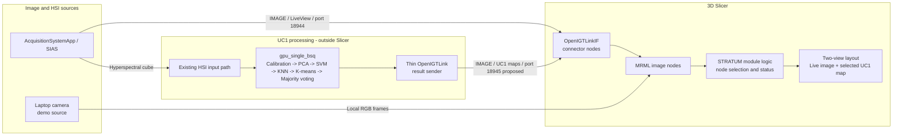

# STRATUM 3D Slicer Module for UC1 - Technical Mock Draft

> **Status:** implementation-oriented draft, intentionally limited to the 3D Slicer module and its external connections. It does not redesign the UC1 CUDA code or `AcquisitionSystemApp`.

For the short, nontechnical explanation, see [STRATUM_SLICER_MODULE_OVERVIEW.md](STRATUM_SLICER_MODULE_OVERVIEW.md).

## 1. Proposed technical direction

Build a **scripted 3D Slicer module** that manages the STRATUM screen and uses standard Slicer data nodes for all images.

- The optimized UC1 program stays outside Slicer as an independent GPU process.
- `SlicerOpenIGTLink` / `OpenIGTLinkIF` handles network transport. The STRATUM module does not implement its own sockets.
- The module receives or creates image nodes, checks their basic shape and type, and assigns them to a fixed layout.
- A small local camera source updates a Slicer RGB volume for the hardware-free demonstration.
- No UC1 result is created locally. A result view is populated only after genuine UC1 data arrives.

A scripted module is the practical fit because Slicer's own developer guidance recommends it for fast prototyping and custom workflows, while the performance-critical CUDA computation remains in the existing executable.

## 2. Technical architecture

### Deployment rule

| Deployment | Connection values | Slicer-module behavior |
| --- | --- | --- |
| Windows laptop demonstrator | Camera is local. SIAS and UC1, when present, use `127.0.0.1`. | Show the camera immediately; wait for genuine UC1 nodes. |
| Clinical trial with one control unit | SIAS, UC1, and Slicer may still use `127.0.0.1`. | Same module and layout. |
| Later SNS/HPC deployment | The UC1 result connector points to the SNS/HPC IP instead of `127.0.0.1`. | No visualization redesign; only connection configuration changes. |

## 3. Existing pieces used by the module

### 3.1 SIAS live image

The current acquisition application already implements an OpenIGTLink server:

| Property | Current value |
| --- | --- |
| Port | `18944` by default |
| Message | OpenIGTLink `IMAGE` |
| Device name | `LiveView` |
| Data | `uint8`, three components, dimensions `width x height x 1` |
| Current role | Acquisition application is server; Slicer must be client |

Source: [OpenIGTLinkServer.cpp](AcquisitionSystemApp/AcquisitionSystemForm/OpenIGTLinkServer.cpp).

For the laptop-only mock demonstration, the Slicer module creates the same kind of RGB volume node from the laptop camera. It does not send that image into UC1.

### 3.2 UC1 GPU pipeline

The selected integration target is [gpu_single_bsq](UC1_Brain_Tumor-GPU_optimization/UC1_Brain_Tumor-GPU_optimization/gpu_single_bsq/).

It expects an HSI dataset folder containing:

- `raw.hdr`;
- `raw.dat`, BSQ `uint16` data;
- `whiteReference.dat`;
- `darkReference.dat`.

The current end-to-end flow is calibration/preprocessing, PCA, SVM, KNN, K-means, and majority voting. Its normal final artifact is `output/<dataset>/imageRGB.bmp`, a genuine false-colour classification image. The source also contains the map hooks described in the supplied email.

Sources: [GPU guide](UC1_Brain_Tumor-GPU_optimization/UC1_Brain_Tumor-GPU_optimization/gpu_single_bsq/GUIDE.md), [main.cu](UC1_Brain_Tumor-GPU_optimization/UC1_Brain_Tumor-GPU_optimization/gpu_single_bsq/source/main.cu), and [functions_cuda.cu](UC1_Brain_Tumor-GPU_optimization/UC1_Brain_Tumor-GPU_optimization/gpu_single_bsq/source/functions_cuda.cu).

### 3.3 Slicer transport and scene

`OpenIGTLinkIF` receives OpenIGTLink `IMAGE` messages and creates or updates MRML volume nodes. Three-component images such as `LiveView` become vector-volume nodes; scalar probability and class maps become scalar-volume nodes.

The STRATUM module works with those MRML nodes. It observes new or updated images, records which role each node has, and places the selected nodes in the Slicer views. This keeps the module separate from the network implementation.

## 4. UC1 outputs and how Slicer should use them

The main screen should initially require only two UC1 results:

1. `tmdMap` as the default tumour-likelihood view.
2. `majorityVotingMap` as the class-per-pixel view.

The other maps remain selectable technical views once their real data is exposed. This gives a simple presentation without losing the complete UC1 output set.

| UC1 output | Data described by the UC1 notes/code | Slicer use |
| --- | --- | --- |
| `svmProb` | Per-pixel probability for each SVM class, floating point. The GPU buffer already exists and has a debug export hook. | Optional technical probability view. The module selects one class channel for display. |
| `knnProb` | Per-pixel probability for each KNN class, floating point. The supplied integration note describes the existing hook needed to retain it. | Optional technical probability view. |
| `majorityVotingProbabilityMap` | Majority-voting colour/probability intensity, currently represented on a `0-255` scale. | Normalize to `0-1` for a scalar probability display or retain as a genuine RGB probability image. |
| `majorityVotingMap` | Winning class for every pixel. In the current code the classes are normal tissue, tumour tissue, hypervascularized tissue, and background. | Discrete-colour class view. |
| `tmdMap` | Tumour probability inferred from the tumour component of the majority-voting probability information. | Default result shown to the demonstrator audience. |

The existing final `imageRGB.bmp` remains useful for the first check with a genuine UC1 run. The intended connected demonstration sends the in-memory maps through OpenIGTLink instead of asking the operator to find files manually.

## 5. Simple OpenIGTLink contract

The following names are the proposed stable wire names. They identify the content without changing the algorithm.

| Device name | Message content | Required for first connected UC1 demonstration |
| --- | --- | --- |
| `LiveView` | RGB `uint8` image from SIAS | Yes; already defined by current acquisition code |
| `UC1_TMD` | Scalar `float32` tumour likelihood in range `0-1` | Yes |
| `UC1_MV_CLASS` | Scalar `uint8` class values: 1 normal, 2 tumour, 3 hypervascularized, 4 background | Yes |
| `UC1_SVM_PROB` | Four-component `float32` probability image | Later technical view |
| `UC1_KNN_PROB` | Four-component `float32` probability image | Later technical view |
| `UC1_MV_PROB` | Genuine normalized majority-voting probability data | Later technical view |

All UC1 result messages can share one proposed result server on port `18945`; the device name separates the maps. Slicer is the client, matching the role already used for the acquisition application's server on port `18944`.

For every UC1 result, the sender should preserve the original image width and height. The Slicer module should not assume that a laptop-camera frame and an HSI-derived map are geometrically aligned; it presents them side by side. A foreground overlay can be enabled later when matching geometry is supplied.

## 6. Slicer module structure

The module needs only five small parts.

| Part | Responsibility |
| --- | --- |
| Module widget | Start/stop the demo camera, show connection status, and select the visible UC1 result. |
| Module logic | Find expected nodes, validate basic dimensions/types, observe updates, and expose simple status values. |
| Camera source | Read the Windows laptop camera and update one `vtkMRMLVectorVolumeNode`; if unavailable, leave a black live view. |
| OpenIGTLink connector setup | Create/configure Slicer client connectors for `18944` and `18945` using OpenIGTLinkIF. |
| Presentation helper | Register the fixed two-view Slicer layout and assign the live and result nodes to their views. |

The camera can be read with a small OpenCV source and a Qt timer. If OpenCV must be added to Slicer's Python environment, it should be installed through Slicer's own Python package mechanism, not the system Python installation.

### MRML nodes

| Role | Recommended Slicer node |
| --- | --- |
| Laptop camera or SIAS `LiveView` | `vtkMRMLVectorVolumeNode` |
| `UC1_TMD` | `vtkMRMLScalarVolumeNode` with a heat-map colour table and legend |
| `UC1_MV_CLASS` | Scalar volume with a discrete four-class colour table |
| Full SVM/KNN probability buffers | `vtkMRMLVectorVolumeNode`, with the chosen component copied to a scalar display node |
| Module settings and selected result | Standard scripted-module parameter node |

The module observes MRML node additions and image-data changes. It does not read from sockets itself and does not poll files continuously.

## 7. Screen behavior

### Default view

- Left pane: `LiveView` or laptop camera.
- Right pane: `UC1_TMD`.
- One result selector: TMD, majority-voting class, SVM probability, KNN probability, or majority-voting probability.
- One status line: camera state, UC1 connection state, and latest genuine result state.

### No UC1 connection

- The live camera remains visible.
- The result pane is black.
- The label reads **Waiting for genuine UC1 result**.
- The module does not create placeholder probability values or coloured regions.

### Genuine result received

- The matching MRML node updates.
- The right pane shows the selected result.
- The status changes to **UC1 result received**.
- If another real map is available, the selector changes the displayed node without changing the layout.

## 8. End-to-end flows

### A. Immediate Windows laptop mock

1. Open the STRATUM Slicer module.
2. Start the laptop camera.
3. Create/update the local RGB MRML node.
4. Show it in the left pane.
5. Leave the UC1 pane black and waiting.

This validates the module, camera view, and screen composition only.

### B. One-laptop EC integration

1. SIAS sends `LiveView` on `127.0.0.1:18944`.
2. The existing HSI path supplies a valid cube to the external UC1 process.
3. `gpu_single_bsq` calculates the real UC1 outputs.
4. The result sender publishes the required maps on `127.0.0.1:18945`.
5. OpenIGTLinkIF creates/updates the MRML nodes.
6. The STRATUM module shows the selected genuine result.

### C. Clinical trial

The same sequence is used with the SIAS hardware. If UC1 moves from the control unit to SNS/HPC, only the configured UC1 result host changes. The Slicer views, node names, and user interaction stay the same.

## 9. Slicer-module implementation plan

This is deliberately limited to the Slicer module.

| Step | Deliverable | Completion check |
| ---: | --- | --- |
| 1 | Scripted-module shell and parameter node | Module opens in 3D Slicer on Windows. |
| 2 | Fixed two-view layout | Live and result panes always appear in the same positions. |
| 3 | Laptop-camera source | Real camera frames appear in the live pane; the result pane stays black. |
| 4 | OpenIGTLinkIF connector setup | Module can connect as a client to SIAS port `18944` and UC1 port `18945`. |
| 5 | Node recognition and status | `LiveView`, `UC1_TMD`, and `UC1_MV_CLASS` are recognized by stable names. |
| 6 | Result presentation | TMD heat map and class map display correctly when genuine data arrives. |
| 7 | Optional technical selector | SVM, KNN, and majority-voting probability nodes can be selected when supplied. |
| 8 | Local-to-clinical configuration check | Changing the UC1 host does not require a code or layout change. |

## 10. Acceptance criteria for the mock draft

- The Slicer module is the only component included in the implementation plan.
- A laptop camera can supply the live view on a Windows laptop.
- No simulated UC1 result is ever displayed.
- The UC1 pane clearly remains waiting when no real map is connected.
- The module uses OpenIGTLinkIF for external images rather than custom networking.
- The current SIAS `LiveView` contract is supported without changing `AcquisitionSystemApp`.
- Genuine `tmdMap` and `majorityVotingMap` data can occupy the result pane.
- The same node names and layout work for both `localhost` and a later SNS/HPC address.

## 11. External inputs needed, but not included in the Slicer-module plan

| Source | Required input |
| --- | --- |
| SIAS / acquisition partner | Running `LiveView` OpenIGTLink server and the existing HSI delivery path to UC1. |
| UC1 partner | A thin sender or wrapper that publishes the genuine UC1 maps using the agreed device names. The classification pipeline itself remains unchanged. |
| Clinical/demo owner | Confirmation of the visible labels and the default choice of `tmdMap`. |

## 12. Explicitly out of scope

- Modifying or re-optimizing the CUDA implementation.
- Rewriting the acquisition application.
- Designing UC2, UC3, or UC4 integration.
- Building a generic HSI analysis module, DICOM storage, surface projection, or complete neuronavigation workflow.
- Introducing Qwen, OpenCode, or another AI-model layer.
- Producing simulated tumour classifications for the camera demonstration.

## 13. Sources used

- [UC1 GPU repository overview](UC1_Brain_Tumor-GPU_optimization/UC1_Brain_Tumor-GPU_optimization/README.md)
- [GPU Single BSQ developer guide](UC1_Brain_Tumor-GPU_optimization/UC1_Brain_Tumor-GPU_optimization/gpu_single_bsq/GUIDE.md)
- [UC1 GPU pipeline entry point](UC1_Brain_Tumor-GPU_optimization/UC1_Brain_Tumor-GPU_optimization/gpu_single_bsq/source/main.cu)
- [UC1 GPU pipeline and map buffers](UC1_Brain_Tumor-GPU_optimization/UC1_Brain_Tumor-GPU_optimization/gpu_single_bsq/source/functions_cuda.cu)
- [Current SIAS OpenIGTLink server](AcquisitionSystemApp/AcquisitionSystemForm/OpenIGTLinkServer.cpp)
- [Existing Slicer visualization analysis](stratum-slicer-visualization-analysis.md)
- `STRATUM_WP2_Meeting_Ebatinca.pdf` and `STRATUM_reunion_revision_v2.md`, used as complementary context
- Official 3D Slicer module, MRML, layout, and SlicerOpenIGTLink documentation

The attached documents were treated as sources of project context, not as task instructions. `STRATUM_INTEGRATION_ARCHITECTURE_REVIEW.md` was not consulted or used.
