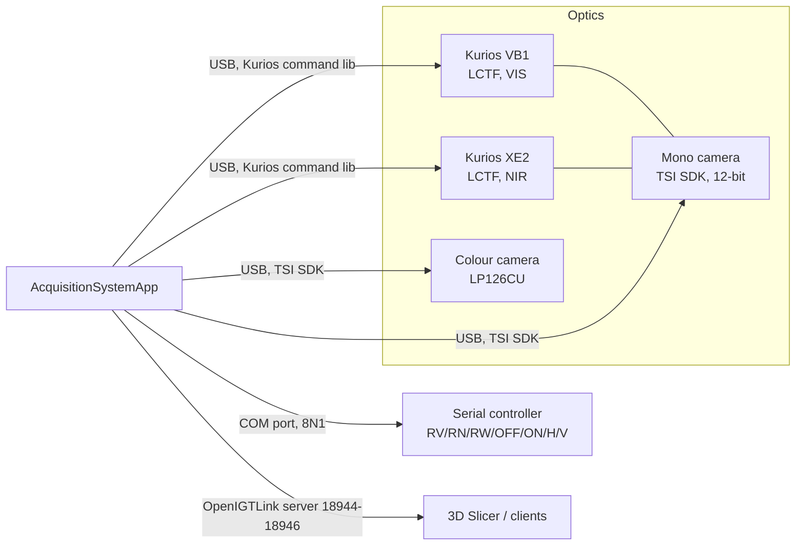

# STRATUM acquisition app and hyperspectral hardware

Reference for the IUMA **AcquisitionSystemApp** and the Thorlabs hardware it
drives. It is written for future SLIAFlow work (capture integration, OpenIGTLink
links, cube readers). It is prototype documentation, not a validated
description of a clinical system.

Written 2026-09-23. No hardware was connected. The app was delivered only as
an installer, without source. Everything below comes from:

- **[run]**: launching the app on this laptop, with no hardware attached;
- **[bin]**: static analysis of the executable (the .NET metadata, the IL
  bodies, native strings and imports), with no decompiler and no changes;
- **[sys]**: Windows driver and device records, ThorCam logs, installed files;
- **[inf]**: inference. Treat these as unconfirmed until checked on the
  hardware;
- **[iuma]**: statements from IUMA, relayed by the project owner on
  2026-09-23 (§8).

No installed file was modified during the analysis.

## 1. Installed software

| Item | Location | Version / notes |
| --- | --- | --- |
| AcquisitionSystemApp | `C:\Program Files\IUMA\InstallerAcquisitionApp\` | Installer "InstallerAcquisitionApp" 1.0.0 by IUMA, installed 2026-09-22. The exe was built 2026-09-21. [sys] |
| Installer source | `Documents\260921_AcquisitionAppDevelopment\` | `InstallerAcquisitionApp.msi` plus `setup.exe` [sys] |
| ThorCam | `C:\Program Files\Thorlabs\Scientific Imaging\ThorCam\` | ThorCam 3.7.0.6, Thorlabs camera SDK 2.1.0.0 [sys] |
| Thorlabs SDK and docs | `...\Scientific Imaging\Documentation\`, `...\Scientific Camera Support\Scientific_Camera_Interfaces.zip` | C, .NET, **Python**, MATLAB and LabVIEW camera APIs, with PDF and CHM references [sys] |
| Runtime config | `C:\STRATUM-Captures\config.xml` | Created on the app's first run (2026-09-22) [sys] |

### Application binary facts [bin]

- `AcquisitionSystemApp.exe` is a **mixed-mode C++/CLI** x64 program. The UI
  uses Windows Forms on .NET Framework 4.7.2. The hardware control is native
  C++.
- It is a **Debug build**. It links `MSVCP140D.dll` and `ucrtbased.dll`, and
  those debug runtimes ship in the install folder. Expect lower performance
  and extra runtime checks. Microsoft does not license the debug CRT for
  redistribution.
- It is a console-subsystem executable, so a console window opens behind the
  GUI. Diagnostic messages are written there, including per-band timing.
- It statically links **OpenIGTLink** (`OpenIGTLink.lib`) and nlohmann/json.
  It imports `KURIOS_COMMAND_LIB_Win64.dll` and loads the Thorlabs TSI camera
  SDK DLLs dynamically. `opencv_world412.dll`, the EDT, Pleora and Fenrir
  CCD DLLs, and `thorlabs_tsi_polarization_*` are bundled but are not
  imported by the app.
- `thorlabs_tsi_logger.cfg` points SDK logs to `C:\SDK_log_files\`. No logs
  were produced during the test run.

## 2. Hardware the app is built for



### 2.1 Cameras (Thorlabs Scientific Camera / TSI SDK)

The app opens **two cameras** through the Thorlabs TSI SDK
(`thorlabs_tsi_camera_sdk.dll`, the `tl_camera_*` API). [bin]

| Role in code | How it is selected | Used for |
| --- | --- | --- |
| `mainCamera` (hyperspectral) | The first discovered camera with a **monochrome** sensor (`connectCameraBW`) | Every spectral band, the dark reference, and one half of the stereo stream |
| `rgbCamera` | The first discovered camera with a **Bayer colour** sensor (`connectCameraRGB`); the error is "No RGB camera found" | The on-screen live view, the `LiveView` stream, and the other half of the stereo stream |

Evidence for the actual models:

- **Colour camera: Thorlabs Kiralux `LP126CU`, serial 29223.** ThorCam's log
  from 2026-09-22 10:43 records it
  (`%LOCALAPPDATA%\TSI\2026-09 ThorCam Log.txt`). The LP126CU is a 12.3 MP
  colour CMOS camera in a low-profile housing with a C-mount and USB 3.0.
  [sys]
- **Monochrome camera: model not confirmed.** The recorded example cube is
  **4096 × 2160** pixels, 12-bit (saturation value 4095), and its header
  says `sensor id = monochromatic`. That resolution matches the Kiralux
  8.9 MP mono camera (CS895MU class). [inf] Check the label or ThorCam's
  camera info when the hardware is available.
- Windows recorded **Thorlabs "Compact Scientific" USB cameras**
  (`USB\VID_1313&PID_4001`, driver `tsiusbcamera.inf`) that were connected
  on 2026-09-22 between 10:40 and 11:04, which was probably during the
  installation. All of them are now disconnected. [sys]

Camera setup performed by the app [bin]:

- The trigger mode is software-triggered. Frames per trigger are continuous
  (0) during live view, 1 per band during a capture, and 3 for the dark
  reference. Binning is 1 × 1.
- Gain is configured in **dB** and converted with
  `tl_camera_convert_decibels_to_gain`. Exposure uses the TSI SDK unit,
  **microseconds**.
- Colour frames go through the Thorlabs mono-to-colour processor (sRGB)
  using the red, green and blue gains from the configuration.

### 2.2 Liquid crystal tunable filters (Thorlabs Kurios)

The system uses **two Kurios LCTFs** through `KURIOS_COMMAND_LIB_Win64.dll`,
which provides `common_List`, `common_GetHandle`, `common_Close`,
`kurios_Set/Get_Wavelength`, `kurios_Set/Get_BandwidthMode` and
`kurios_Get_Temperature`. [bin]

| Filter | Model (from the example cube header) | Range hard-coded in the app | Bandwidth mode used |
| --- | --- | --- | --- |
| VIS | **Kurios VB1** | 460–730 nm | MEDIUM |
| NIR | **Kurios XE2** | 650–1000 nm | NARROW |

- The combined acquisition range is **460–1000 nm**. Wavelengths above
  **710 nm** are routed to the NIR filter; lower ones use the VIS filter.
  The filter that is not in use is set to BLACK (blocking). [bin]
- The Kurios bandwidth-mode codes in the API are 1 = BLACK, 2 = WIDE,
  4 = MEDIUM and 8 = NARROW. The app uses 1, 4 and 8. [bin]
- Thorlabs' own ranges are 420/430–730 nm for the VIS models and
  650–1100 nm for the XE2. The app deliberately uses a narrower window.
- Two filter serial numbers are embedded in the binary: **01483596** and
  **01480101**. `initializeLCTF` matches the enumerated devices against
  them, and the error "Wrong serial number provided for the filter" follows
  from a mismatch. **Replacing a filter therefore requires a rebuilt
  binary.** Which serial belongs to VIS and which to NIR is not known. [bin]
- Filter temperatures are read and written into the cube header. The
  example cube shows about 40 °C for both filters. [bin]
- Switching between VIS and NIR is slow. The code sleeps up to **5 s** at
  the crossover and 0.5 s in the other transitions. [bin]

### 2.3 Serial controller (unknown device)

A second device is driven over a **Windows COM port** by the app's own
`SerialPort` class. [bin]

- Line settings: 8 data bits, no parity, 1 stop bit, with DTR and RTS
  asserted. The read and write timeouts are 50 ms plus 10 ms per byte. The
  baud rate and the port name are not literals in the binary; they are set
  at runtime.
- The commands are short ASCII strings:

| Method | Command | Called when |
| --- | --- | --- |
| `sendCommandSwitchVIS` | `RV:` | Tuning to a VIS wavelength |
| `sendCommandSwitchNIR` | `RN:` | Tuning to a NIR wavelength |
| `sendCommandSwitchWL` | `RW:` | Restoring the default mode after a capture (live view) |
| `sendCommandSwitchBLACK` | `OFF:` | Starting the dark reference |
| `sendCommandSwitchON` | `ON:` | Ending the dark reference |
| `sendCommandHeating` | `H:` | Filter or lamp heating (not seen being called) |
| `sendCommandCheckVersion` | `V:` | Reading the firmware version (reply of up to 256 bytes) |

[inf] The call pattern (off during the dark reference, white light for live
view, VIS or NIR routing per band) suggests this is an **illumination or
optical-path controller**, probably a custom microcontroller board. Confirm
this with IUMA.

### 2.4 Drivers present on this laptop [sys]

| Driver | Version | Relevance |
| --- | --- | --- |
| `tsiusbcamera.inf` (Thorlabs Scientific Imaging) | 1.2.3.14 | **Required** for the TSI USB cameras (Kiralux, Zelux, CS-series) |
| Cypress `cyusb3` (in `Scientific Camera Support\Camera Drivers`) | n/a | USB 3 support for the scientific cameras |
| FTDI `ftdibus.inf` / `ftdiport.inf` | 2.12.36.20 | USB-to-serial virtual COM ports. [inf] Likely needed for the Kurios controllers and/or the serial controller |
| `uc480_64.inf` (DCx cameras) | 4.80.5.0 | Installed by ThorCam; **not used** by the app |

No Kurios or FTDI device has ever been connected to this laptop. The only
COM ports present are Bluetooth serial links (COM3 and COM4), which are
unrelated to the app.

## 3. How the app works

### 3.1 Start-up sequence (`GUI_Load`) [bin] [run]

1. The app creates the controllers: `mainCamera`, `rgbCamera` and the Kurios
   pair.
2. It starts **three OpenIGTLink servers** (see §4) and reads
   `config.xml`.
3. It connects the colour camera, then the mono camera, and configures both.
4. It initialises the Kurios filters.
5. It applies LiveExposure and Gain to both cameras.
6. It starts the `LiveViewWorker` background thread.

When no hardware is connected the window opens normally with a black viewer.
No error dialog appears, the status bar keeps its placeholder text
(`labelInfo`), and the three ports listen anyway. [run]

### 3.2 Main window

The top bar has five buttons: Capture HSI, White Reference, Dark Reference,
Load HS Cube and Settings. [run]

| Control | Behaviour |
| --- | --- |
| **Capture HSI** | Runs the full hyperspectral acquisition (§3.3). The button is disabled while a capture runs. |
| **White Reference** | **Does nothing in this build.** The button has no click handler. [bin] For now the white and dark reference files are given to the BSC program by hand, as separate references (§8). [iuma] |
| **Dark Reference** | **Does nothing in this build.** The button has no click handler. The dark reference is taken automatically inside Capture HSI. [bin] |
| **Load HS Cube** | Opens an ENVI cube in the *Hyperspectral Cube Viewer* (§3.5). |
| **Settings** | Opens the *System Settings* dialog (§5). |
| Viewer | Shows the **colour camera** live image, scaled to fit. |
| Status bar | Shows progress and error messages. |

Live view runs on its own thread. Each iteration grabs one frame from each
camera, publishes them over OpenIGTLink, and hands the colour frame to the
UI. UI refreshes are coalesced. [bin]

### 3.3 Hyperspectral capture (`DataCaptureWorker`) [bin]

Live view is stopped and a folder
`<Default_Save_Path>\Capture_yyyyMMdd_HHmmss\` is created. The worker then
reports five stages:

1. **Preparing capture.** The band count is
   `(maxλ − minλ) / step + 1`, taken from the Kurios range and the
   acquisition step. The per-band exposure schedule is loaded: every band
   gets the base `Exposure`, or, in variable-exposure mode, values from
   `<Default_Save_Path>\csv\Characterization.csv`. That file does not exist
   on this laptop. If it is required and missing, a "File not found" box
   appears.
2. **Capturing dark reference.** The serial controller receives `OFF:` and
   the app waits 2 s. The filters are tuned to 650 → 660 nm, the exposure is
   set to `DarkRefExposure`, and **3 frames are averaged**. Then the
   controller receives `ON:` and the app waits 5 s.
3. **Capturing spectral bands.** For each band the app sets that band's
   exposure, tunes the Kurios, waits for a frame (polling every 10 ms) and
   stores it as uint16. If the `HsCube` server is running, a transmission
   thread sends each band over OpenIGTLink while acquisition continues.
4. **Saving hyperspectral files.** The app writes `raw_data.raw` and
   `raw_data.hdr` (all bands) and `DR.raw` and `DR.hdr` (the dark
   reference, 1 band).
5. **Restoring acquisition state.** The camera returns to 1 frame per
   trigger, the Kurios filters go back to their default mode (`RW:`), and
   the exposure is restored. Live view restarts.

With the 5 nm step used in the example cube, the capture has **109 bands**
and a single cube occupies **about 1.93 GB**
(4096 × 2160 × 109 × 2 bytes).

### 3.4 Output format [bin]

Both files are ENVI Standard, **uint16 (data type 12), BSQ, little-endian,
header offset 0**. The current build writes these header keys:

```
ENVI
description = {STRATUM hyperspectral capture}
samples, lines, bands, header offset = 0, file type = ENVI Standard,
data type = 12, interleave = bsq, byte order = 0,
step, base exposure, scale factor,
nir filter temperature, vis filter temperature,
wavelength = {...}, exposure = {...}
```

The **example cube**
(`C04_HUGCDN_2026-03-05T124238`, recorded 2026-03-05) was written by an
**earlier prototype** ("stratum hs acquisition prototype v1.0") and uses
different keys:

- `wavelength units`, `acquisition time` and `saturation value`;
- `exposure vector` (its declared units are `ns`, although the TSI SDK
  works in µs);
- `sensor type = liquid crystal tunable filter - kurios vb1 + kurios xe2`
  and `sensor id`;
- `temperature nir/vis filter` (written with a decimal comma), `mode nir/vis
  filter`, `magnification` and `prototype version`.

The example folder also contains `M01.jpg` (a marker image) and
`exposureTime.csv`. **Any SLIAFlow reader must tolerate both header
dialects.**

### 3.5 Hyperspectral Cube Viewer (Load HS Cube) [bin]

- The viewer accepts `.hdr` or `.raw` and finds the matching file. It
  **only supports ENVI uint16 BSQ** cubes and rejects everything else with a
  clear message.
- It loads the **whole cube into RAM** (about 1.9 GB for the example) and
  shows one band at a time. A slider selects the band, and each band is
  displayed with an automatic contrast stretch.
- **Send Capture** replays the loaded, recorded cube band by band on the
  `HsCube` OpenIGTLink stream. The same transmission path as a live capture
  is used; internally the code calls this `SimulatedCaptureWorker`. The
  server must be running. This gives a hardware-free way to feed Slicer with
  real recorded data.

### 3.6 Clinical data model (present, not wired) [bin]

The binary contains a data model that the current UI never uses:

- **Hospitals:** `KUH` (Karolinska University Hospital), `HU12O` (Hospital
  Universitario 12 de Octubre) and `HUGCDN` (Hospital Universitario de Gran
  Canaria Doctor Negrín).
- **Patient:** ID, hospital, a root directory, and a calibration folder
  named `Calibration_<code>…`.
- **CaptureData:** an ID of the form `C01`–`C99`, a type (*Surface*,
  *Mid-point*, *End-resection* or *Unknown*), a timestamp, and markers. The
  folder name is `C<ID>_<hospital>_<yyyy-MM-ddTHHmmss>`, which matches the
  example folder `C04_HUGCDN_…`.
- **Marker:** an ID `M<nn>`, a type (*No Marker*, *Normal Tissue*, *Tumour
  Centre* or *Tumour Border*), a 3D coordinate, a fiducial coordinate, a
  biopsy flag and a description.

These names are useful vocabulary if SLIAFlow later needs to align with
IUMA's capture organisation. Any patient-level data remains subject to
`.ai/policies/medical-data-policy.md`.

## 4. OpenIGTLink interface [run] [bin]

The app is the **server**. Slicer (for example OpenIGTLinkIF) connects to it
as a client.

| Device name | Port | Content |
| --- | --- | --- |
| `LiveView` | `P` = **18944** | Colour camera frames, RGB 8-bit, 3 channels |
| `Steroscopic` *(spelled this way in the code)* | `P+1` = **18945** | Colour and mono frames, each centre-cropped to a common size and packed side by side (colour is passed first, so probably on the left [inf]), RGB 8-bit |
| `HsCube` | `P+2` = **18946** | One `IMAGE` message per spectral band, sent during a capture or by Send Capture. Today this is the **raw** cube as uint16. A future version will send the **calibrated** cube as float32 (§8). [iuma] |

- `P` comes from the hidden config key `OpenIGTLinkPort` and defaults to
  18944. [bin] The ports actually observed were 18944, 18945 and 18946. [run]
- The servers listen on **0.0.0.0 (all interfaces)**. On a network with
  other hosts this exposes the streams. [run]
- Changing Settings restarts **only** the `LiveView` server. [bin]
- These ports overlap the range SLIAFlow used before `SLIA-027`
  (18944–18947 and 18950; see `docs/development/openigtlink_setup.md`). Do
  not run a SLIAFlow server on the same machine at the same time.
- Full-resolution colour frames from a 12.3 MP sensor are large (about
  36 MB each as RGB 8-bit). Live-stream throughput has not been measured.
  [inf]

## 5. Configuration: `C:\STRATUM-Captures\config.xml`

The file is created with a template on first run if it is missing. It is
read at start-up and **written only when Apply is pressed** in *System
Settings*. [bin] [run] The dialog builds one editor per XML element found:
a checkbox for booleans, a numeric box for integers and doubles, and a text
box otherwise.

| Key | Unit | Code default | Template (new file) | Value on this laptop | Effect |
| --- | --- | --- | --- | --- | --- |
| `Hospital` | text | empty | empty | empty | Free text (no drop-down) |
| `LiveExposure` | µs | 5000 | 5000 | 5000 | Live-view exposure for both cameras |
| `Exposure` | µs | 25000 | 25000 | 25000 | Base per-band capture exposure |
| `DarkRefExposure` | µs | 250000 | 250000 | 250000 | Dark-reference exposure |
| `Gain` | dB | 0 | 0 | **20** | Camera gain |
| `Red_Gain` / `Green_Gain` / `Blue_Gain` | factor | 2.63 / 1.0 / 3.41 | **1.8 / 1.0 / 1.96** | 2.63 / 1 / 3.41 | Colour-camera white balance |
| `Default_Save_Path` | path | `C:\STRATUM-Captures` | same | same | Root of the capture folders and of `csv\Characterization.csv` |
| `OpenIGTLinkPort` | int | 18944 | *(absent)* | *(absent)* | Base port `P`. Hidden unless added to the XML by hand |
| `IP` / `PORT` | text / int | `127.0.0.1` / 2000 | *(absent)* | *(absent)* | Stored in the app state. No consumer was found [bin] |

The code defaults and the new-file template disagree on the colour gains.

## 6. Relevance for SLIAFlow

- **Integration path.** Slicer can consume `LiveView`, `Steroscopic` and
  `HsCube` as an OpenIGTLink client without touching the vendor app. This
  fits the "links return for external hardware" direction noted for
  `SLIA-030`. Direct camera control from Slicer Python would instead use the
  Thorlabs Python SDK (`Scientific_Camera_Interfaces.zip` → `SDK\Python
  Toolkit`). The Kurios filters and the serial controller would then also
  need Python drivers, which is a larger change.
- **Hardware-free testing.** Load a cube, then use **Send Capture** to
  replay it on port 18946. This works with the recorded example cube, or
  with IUMA's synthetic HELICoiD-derived cubes (§8).
- **Calibration.** This build acquires no white reference. Only a dark
  reference is captured, averaged over 3 frames and saved as a single band.
  Until the app sends calibrated cubes, calibration happens outside the
  stream (§8). SLIAFlow should not build its own white/dark handling for
  the live link.
- **Data type change ahead.** `SLIAFlowCasePool.py` accepts only ENVI data
  type 12 (uint16). Once the app sends float32, any SLIAFlow code that reads
  `HsCube` will also have to accept float32. This needs its own task card.
- **Header dialects.** Readers must handle both the current header keys and
  the earlier prototype's keys (§3.4).
- **Fragility.** The Kurios serial numbers are hard-coded, the build uses
  the debug CRT, the app pauses for seconds at the VIS/NIR crossover, and
  there is no visible error state when hardware is missing.

## 7. Open questions for IUMA

1. Which model is the mono hyperspectral camera? The cube size suggests the
   4096 × 2160 Kiralux mono (CS895MU class).
2. What is the serial device (`RV:`/`RN:`/`RW:`/`OFF:`/`ON:`/`H:`/`V:`), and
   which COM port and baud rate does it use?
3. Which Kurios serial number (01483596 or 01480101) is the VIS filter and
   which is the NIR filter?
4. What is the default acquisition step, and when is variable-exposure mode
   (`Characterization.csv`) enabled?
5. ~~Is a white-reference capture planned?~~ Answered 2026-09-23: the app
   will send calibrated cubes instead (§8).
6. Is a Release build and a source or SDK hand-over planned?
7. In the float32 version, which calibration formula will be used, and what
   value range is expected (reflectance 0–1, or other)? Will the ENVI files
   on disk also change type, or only the stream?
8. What band count, wavelengths and image size do the synthetic HELICoiD
   cubes have, and are they ENVI uint16 BSQ (the only format the viewer
   loads)?

## 8. IUMA decisions (2026-09-23) [iuma]

The project owner relayed the following from IUMA on 2026-09-23.

1. **Current calibration.** For now the white and dark reference files are
   given to the BSC program by hand, as separate references. Only the
   **raw** cube is transmitted. This explains why the White/Dark Reference
   buttons are not wired (§3.2). The calibration files for the example
   capture are on the project Nextcloud (link held by the project owner).
2. **Future stream: calibrated float32.** IUMA has decided that the app will
   send the **calibrated** cube over OpenIGTLink. SLIAFlow will then not
   need to handle white or dark references. Integration will take time
   because it must be agreed with the BSC. The **protocol and message
   structure will not change**. Only the pixel type changes, from
   unsigned 16-bit integer to 32-bit single-precision float. In OpenIGTLink
   `IMAGE` terms, the scalar type goes from uint16 (5) to float32 (10). The
   ports, device names and one-message-per-band scheme stay the same. The
   current uint16 stream is therefore a valid target for validating the
   communication protocol and structure now.
3. **Validating Asaf's (BSC) software.** It is understood to work with
   **synthetic cubes**. These were generated from HELICoiD images and
   processed to have a band count and spectral response similar to the
   LCTF. They can be loaded into the capture app (Load HS Cube) and
   transmitted with Send Capture. The viewer loads only ENVI uint16 BSQ
   (§3.5), so these cubes must be in that format. These cubes are derived
   from clinical imagery. Using them in this repository is subject to
   `.ai/policies/medical-data-policy.md`. Do not commit them.
